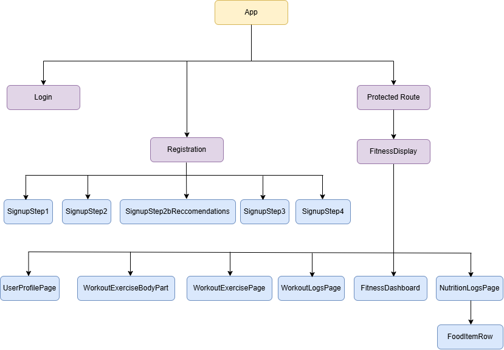

# HRJ3 - Fitness Tracker

A comprehensive full-stack fitness tracking application that helps users monitor their nutrition, plan workouts, and track their progress toward fitness goals.

## Table of Contents

- [📱 App Features](#-app-features)
- [💻 Technology Stack](#-technology-stack)
- [🖧 Component Tree & Architecture](#-component-tree--architecture)
- [🔧 Backend API Integration](#-backend-api-integration)
- [🔑 Secure Configuration with .env Variables](#-secure-configuration-with-env-variables)
- [💡 Project Objectives & Takeaways](#-project-objectives--takeaways)
- [⚔️ Project Challenges](#-project-challenges)
- [🚀 Future Enhancements](#-future-enhancements)

## 📱 App Features

- **User Authentication**: Secure multi-step registration and login system with JWT-based authentication
- **Nutrition Tracking**: Log daily nutrition intake with automatic macro calculations (protein, carbs, fats) and progress toward calorie goals
- **Customizable Nutrition Goals**: Set personalized daily calorie and macronutrient targets
- **Workout Planning & Logging**: Plan weekly workout schedules by muscle group and log completed exercises with sets, reps, and weight
- **Visual Dashboards**: Real-time charts and progress indicators for both nutrition and workout data
- **User Profile Management**: Editable user information including BMI calculation and profile updates
- **Responsive Design**: Fully responsive UI that works seamlessly across desktop and mobile devices
- **Date-Based Tracking**: View and track daily metrics with date selection for historical data review

## 💻 Technology Stack

**Frontend:**

- React - Component-based UI library for building dynamic interfaces
- Vite - Fast frontend build tool and development server
- CSS3 - Custom styling for responsive design

**Backend:**

- Express.js - Node.js framework for REST API development
- MongoDB - NoSQL database for persistent data storage
- Mongoose - ODM for MongoDB schema modeling and validation
- JWT (JSON Web Tokens) - Secure authentication and authorization
- Bcryptjs - Password hashing for secure credential storage

## 🖧 Component Tree & Architecture



## 🔧 Backend API Integration

**Authentication Endpoints:**

- `POST /users/register` - User registration with multi-step validation
- `POST /users/login` - User login with JWT token generation
- `GET /users/me` - Retrieve authenticated user profile data
- `PATCH /users/{id}` - Update user profile information

**Nutrition Endpoints:**

- `GET /nutritionlogs/users/{userId}` - Retrieve all nutrition logs for a user
- `POST /nutritionlogs` - Create a new nutrition log
- `PUT /nutritionlogs/{id}` - Update an existing nutrition log
- `DELETE /nutritionlogs/{id}` - Delete a nutrition log
- `GET /nutritiongoals/{id}` - Retrieve nutrition goal settings
- `PUT /nutritiongoals/{id}` - Update nutrition goal settings
- CalorieNinjas API @ https://calorieninjas.com/api - Extract detailed nutrition information using text search

**Workout Endpoints:**

- `GET /workoutlogs/user/{userId}` - Retrieve all workout logs for a user
- `POST /workoutlogs` - Create a new workout log
- `PUT /workoutlogs/{id}` - Update an existing workout log
- `DELETE /workoutlogs/{id}` - Delete a workout log
- `GET /workoutgoals/{id}` - Retrieve workout goal settings
- `PUT /workoutgoals/{id}` - Update workout goal settings

**Data Validation:**

- All endpoints include comprehensive input validation and error handling
- Request/response data includes proper error messages and status codes
- Middleware enforces authentication on protected routes

## 🔑 Secure Configuration with .env Variables

To run this application locally, you must create a `.env` file in both the backend and frontend directories with the appropriate credentials. These environment variables are excluded from version control to protect the integrity of your backend services and sensitive credentials.

**Backend (.env):**

```
MONGO_URI=your_mongodb_connection_string
SECRET_ACCESS_KEY=your_jwt_secret_access_key
SECRET_REFRESH_KEY=your_jwt_secret_refresh_key
PORT=5000
```

**Frontend (.env):**

```
VITE_SERVER=http://localhost:5000
VITE_NUTRITION_API_KEY=your_calorieningas_api_key
```

## 💡 Project Objectives & Takeaways

- **Full-Stack Development**: Gained practical experience building a complete MERN stack application with frontend-backend integration
- **React Architecture**: Mastered React component composition, Context API for state management, hooks (useState, useEffect, useMemo), and conditional rendering patterns
- **Backend Development**: Developed REST API endpoints with Express.js, implemented proper authentication/authorization, and designed MongoDB schemas with Mongoose
- **Data Visualization**: Integrated Recharts to create interactive charts for nutrition and workout progress tracking
- **Form Handling & Validation**: Implemented multi-step registration forms with client-side and server-side validation
- **Responsive Design**: Built mobile-friendly UI using CSS Grid, Flexbox, and media queries
- **API Integration**: Established secure communication between frontend and backend using JWT tokens and environment variables

## ⚔️ Project Challenges

- **Multi-Step Form Management**: Navigating state across multiple registration steps while maintaining data integrity and user experience
- **Real-Time Data Synchronization**: Ensuring accurate updates across the dashboard when users create/edit nutrition and workout logs
- **Complex Data Aggregation**: Calculating nutrition macros and workout statistics across multiple log entries for accurate progress visualization
- **User Authentication Flow**: Implementing secure JWT-based authentication with proper token management and error handling
- **Responsive Dashboard Layout**: Creating responsive charts and tables that maintain usability across various screen sizes
- **Date Filtering & Selection**: Implementing efficient date-based filtering for historical data retrieval and display

## 🚀 Future Enhancements

1. **Social Features**: Add ability to share progress, follow other users, and join fitness communities
2. **Advanced Analytics**: Implement weekly/monthly progress charts and trend analysis for better insights
3. **Workout Library**: Create a curated database of exercises with video demonstrations and form tips
4. **Meal Planning**: Integrate a meal database and meal planning features aligned with nutrition goals
5. **Mobile App**: Develop native iOS and Android apps with offline support
6. **Wearable Integration**: Connect with fitness trackers and smartwatches for automatic activity tracking
7. **AI-Powered Recommendations**: Use machine learning to suggest workouts and meal plans based on user data and goals
8. **Export & Reporting**: Generate PDF reports of fitness progress for sharing with trainers or coaches
